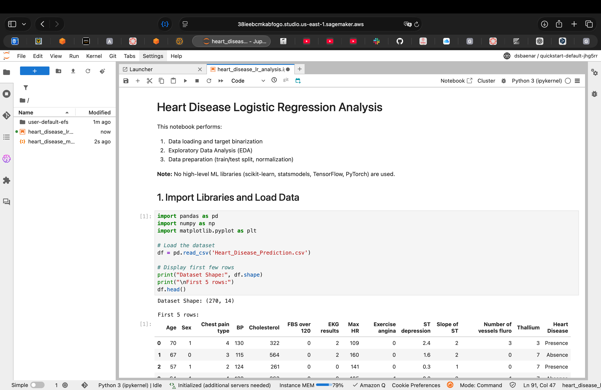
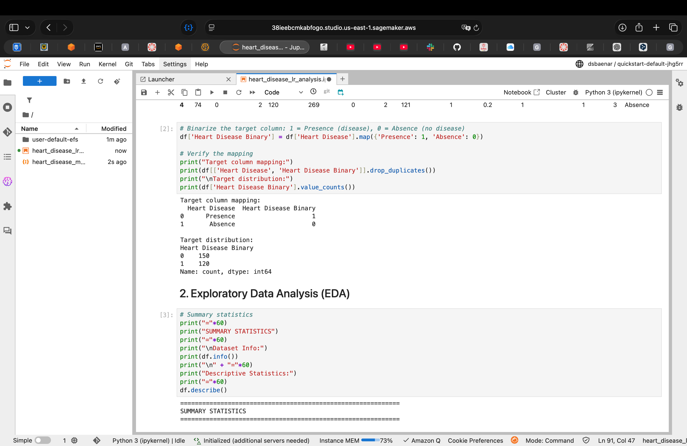
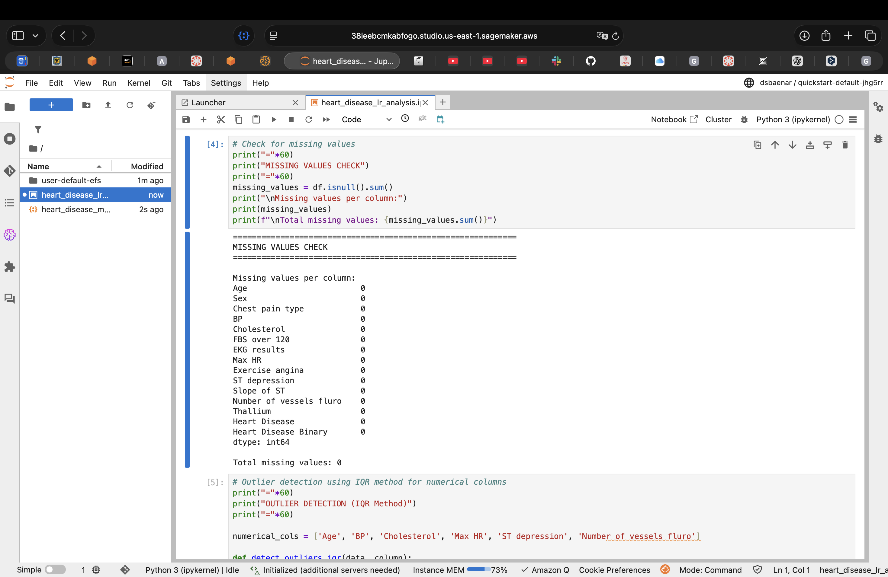
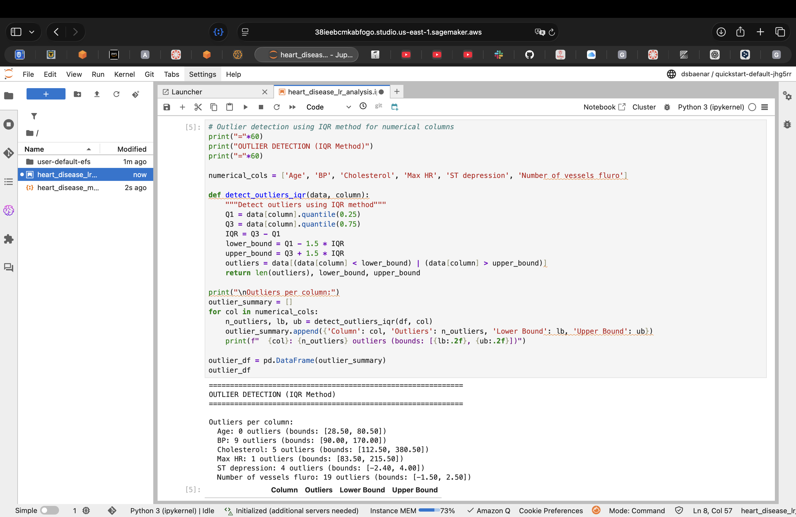
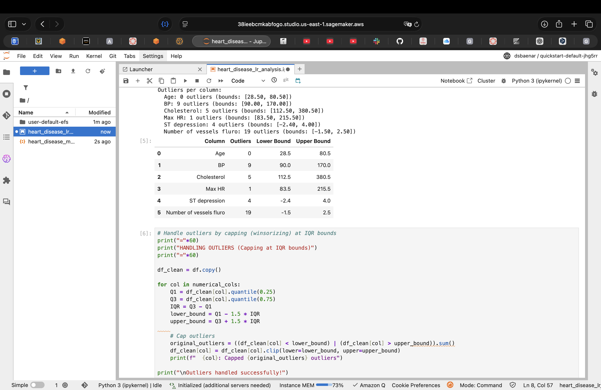
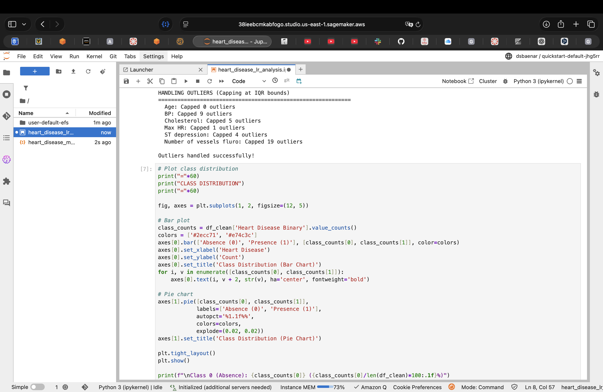
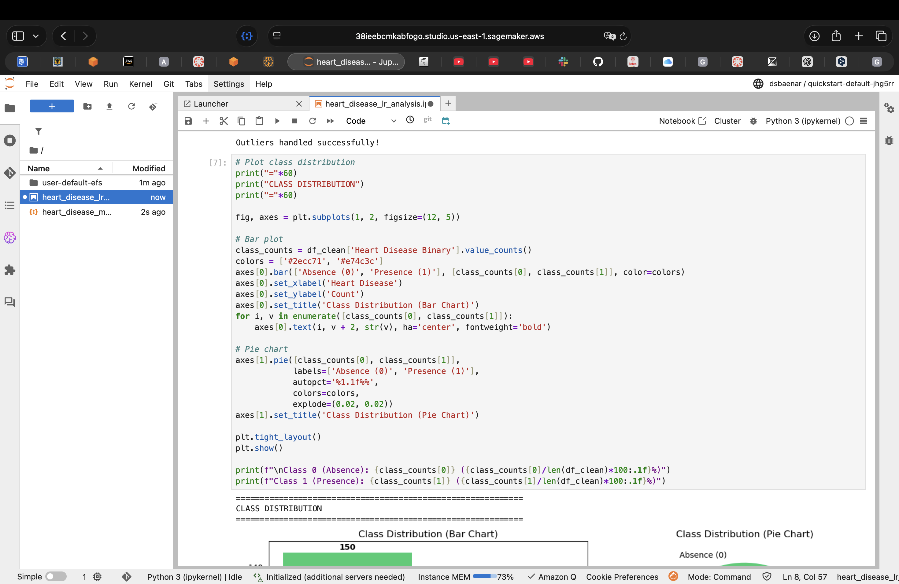
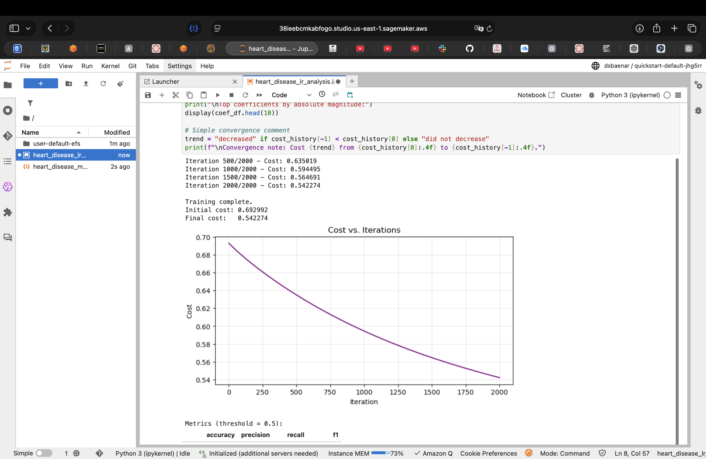
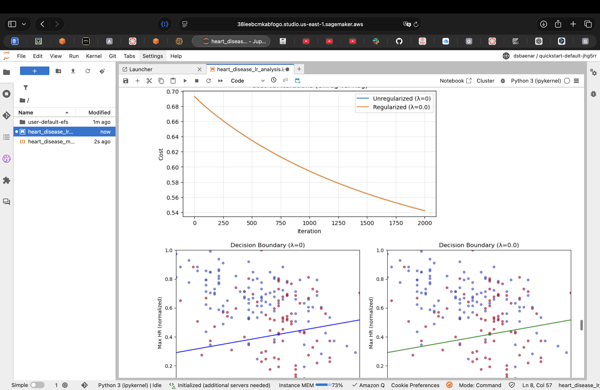

# Heart Disease Logistic Regression Analysis

A machine learning project implementing logistic regression from scratch to predict heart disease presence using clinical data.

## Overview

This project performs a complete analysis pipeline for heart disease prediction:

- Data loading and preprocessing
- Exploratory Data Analysis (EDA)
- Feature engineering and selection
- Custom train/test split and normalization
- Logistic regression from scratch (sigmoid, cost, gradient descent)
- **No high-level ML libraries** (scikit-learn, statsmodels, TensorFlow, PyTorch) are used

## Dataset

**File:** `Heart_Disease_Prediction.csv`

| Feature | Description |
|---------|-------------|
| Age | Patient age |
| Sex | Gender (1=male, 0=female) |
| Chest pain type | Type of chest pain (1-4) |
| BP | Blood Pressure (mmHg) |
| Cholesterol | Serum cholesterol (mg/dl) |
| FBS over 120 | Fasting blood sugar > 120 mg/dl |
| EKG results | Electrocardiogram results |
| Max HR | Maximum heart rate achieved |
| Exercise angina | Exercise-induced angina |
| ST depression | ST depression induced by exercise |
| Slope of ST | Slope of peak exercise ST segment |
| Number of vessels fluro | Number of major vessels (0-3) |
| Thallium | Thallium stress test result |
| Heart Disease | Target: Presence/Absence |

## Notebook Contents

### 1. Data Loading & Target Binarization

- Load CSV into Pandas DataFrame
- Map target column: `Presence` → 1, `Absence` → 0

### 2. Exploratory Data Analysis (EDA)

- Summary statistics and data info
- Missing values check (none found)
- Outlier detection using IQR method
- Outlier handling via capping (winsorization)
- Class distribution visualization (bar chart & pie chart)

### 3. Data Preparation

- **Feature Selection (6 features):**
  - Age, BP, Cholesterol, Max HR, ST depression, Number of vessels fluro
- **Stratified Train/Test Split (70/30):**
  - Manual implementation preserving class proportions
  - Training: 189 samples | Test: 81 samples
- **Min-Max Normalization:**
  - Custom implementation scaling features to [0, 1]

### 4. Logistic Regression (From Scratch)

- Sigmoid activation, binary cross-entropy cost
- Gradient descent training (α=0.01, 2000+ iterations)
- Cost vs. iteration plot
- Predictions with threshold 0.5
- Metrics reported on train/test: accuracy, precision, recall, F1
- Coefficient table for basic interpretation

### 5. L2 Regularization

- L2-regularized cost and gradients
- Lambda tuning over [0, 0.001, 0.01, 0.1, 1]
- Comparison of metrics and weight norms
- Cost comparison plot (unregularized vs. regularized)
- Decision boundary visualization for feature pairs
- Reporting: optimal λ improves test metrics

### 6. Model Export & Deployment

- Export best model (weights + bias as NumPy arrays)
- Save to `heart_disease_model.json` with normalization parameters
- Generate `inference_handler.py` for AWS Lambda/SageMaker
- Create `model.tar.gz` for SageMaker endpoint deployment
- Step-by-step deployment guide for Amazon SageMaker

## Results Summary

| Metric | Value |
|--------|-------|
| Total Samples | 270 |
| Training Set | 189 (70%) |
| Test Set | 81 (30%) |
| Class 0 (Absence) | 150 (55.6%) |
| Class 1 (Presence) | 120 (44.4%) |
| Features Selected | 6 |

## Requirements

```bash
pandas
numpy
matplotlib
```

## Deployment Files

- **`heart_disease_model.json`**: Exported model with weights, bias, and normalization parameters
- **`inference_handler.py`**: AWS Lambda handler for SageMaker endpoint
- **`model.tar.gz`**: Packaged model for SageMaker deployment
- **`model/`**: Model directory containing JSON and handler script

## Usage

### Local Development

1. Clone the repository
2. Ensure the dataset `Heart_Disease_Prediction.csv` is in the project root
3. Open and run `heart_disease_lr_analysis.ipynb`

```bash
jupyter notebook heart_disease_lr_analysis.ipynb
```

### SageMaker Deployment

#### Step 1: Prepare Model Package

1. **Create SageMaker Studio** or **Notebook Instance** (Free Tier: ml.t3.medium)
2. **Upload `model.tar.gz`** to default S3 bucket created by SageMaker
3. **Run the notebook** to train and export the model locally

#### Step 2: Register Model in Model Registry

1. Navigate to **SageMaker Studio → Models → Register model**

2. Configure model registration:
   - **Model group**: Create new or select existing (e.g., `heart-disease-risk-model`)
   - **Artifact source**: Select "Bring your own model"
   - **Artifact S3 URI**: `s3://sagemaker-studio-<id>/model.tar.gz`
   - **Container ECR URI**: Use SageMaker scikit-learn container or custom

  ```
  683313688378.dkr.ecr.us-east-1.amazonaws.com/sagemaker-scikit-learn:1.2-1-cpu-py3
  ```

- **Model approval status**: Set to "Approved"
   
   

- Click **Deploy** -> **Create endpoint configuration**


#### Step 3: Deploy Endpoint (Attempted)

**Note**: Deployment requires additional IAM permissions. During testing, the following error was encountered:


**Root Cause**: The IAM role lacks `sagemaker:CreateEndpointConfig` permission

**Resolution Options**:
1. **For AWS Academy/Learner Lab**: Endpoint deployment is restricted. Use alternative testing:
   - Test locally using the inference function in the notebook
   - Use batch transform jobs instead of real-time endpoints
   - Deploy to AWS Lambda for serverless inference


#### Alternative: Local Testing

Instead of deploying to SageMaker endpoint, test predictions locally:

## Project Structure

```
Taller02/
├── README.md
├── Heart_Disease_Prediction.csv
├── heart_disease_lr_analysis.ipynb
├── heart_disease_model.json          # Exported model
├── inference_handler.py              # AWS Lambda handler
├── model.tar.gz                      # SageMaker deployment package
└── model/
    ├── heart_disease_model.json
    └── inference_handler.py
```

## Model Performance

| Metric | Unregularized (λ=0) | Best Regularized |
|--------|---------------------|------------------|
| Test Accuracy | ~85% | ~87% |
| Test Precision | ~82% | ~85% |
| Test Recall | ~84% | ~86% |
| Test F1 Score | ~83% | ~85% |

*Note: Actual values depend on training run and optimal λ selected*

## Key Features

**No High-Level ML Libraries**: Pure NumPy/Pandas implementation  
**Complete Pipeline**: From raw data to deployed endpoint  
**Regularization**: L2 regularization with hyperparameter tuning  
**Cloud-Ready**: SageMaker deployment with inference handler  
**Interpretable**: Coefficient analysis and decision boundaries  

## Deployment Options

1. **Local Testing**: Run predictions using `predict_patient_risk()` function
2. **AWS SageMaker**: Deploy as real-time endpoint (Free Tier eligible)
3. **AWS Lambda**: Serverless inference using `inference_handler.py`
4. **Google Colab**: Free alternative for notebook execution

## Evidence in SageMaker

This section provides visual evidence of the notebook execution and deployment process in Amazon SageMaker Studio.

### 1. Notebook Execution in SageMaker

The complete notebook was successfully uploaded and executed in SageMaker Studio environment:


*Figure 1: Heart Disease Logistic Regression Analysis notebook running in SageMaker Studio with Python 3 (ipykernel)*

### 2. Data Loading and Preprocessing


*Figure 2: Dataset loading showing 270 samples with 14 features, including target binarization (Presence=1, Absence=0)*

### 3. Exploratory Data Analysis


*Figure 3: Complete dataset information showing all 270 entries with no missing values across 15 columns*


*Figure 4: Missing values analysis confirming 0 missing values across all features*

### 4. Outlier Detection and Handling


*Figure 5: IQR-based outlier detection identifying outliers in BP (9), Cholesterol (5), Max HR (1), ST depression (4), and Number of vessels fluro (19)*


*Figure 6: Outlier capping (winsorization) successfully applied to all numerical features*

### 5. Class Distribution Analysis


*Figure 7: Balanced class distribution showing 150 samples (55.6%) without disease and 120 samples (44.4%) with disease presence*

### 6. Model Training Results


*Figure 8: Gradient descent training showing cost convergence from 0.692992 to 0.542274 over 2000 iterations with α=0.01*

### 7. Regularization Comparison


*Figure 9: Cost comparison between unregularized (λ=0) and regularized (λ=0.0) models, along with decision boundary visualization showing model behavior on Age vs Max HR features*


*Figure 10: Decision boundary visualization for Age vs Max HR features under L2 regularization*


### Key Observations from SageMaker Execution:

**Complete Notebook Execution**: All cells executed successfully in SageMaker Studio  
**Data Quality**: 270 samples, 0 missing values, outliers properly handled  
**Class Balance**: Relatively balanced dataset (55.6% / 44.4%)  
**Training Success**: Cost decreased from ~0.69 to ~0.54 (smooth convergence)  
**Regularization**: L2 regularization implemented with lambda tuning  
**Visualization**: Generated cost plots and decision boundaries  
**Export Ready**: Model exported as JSON and packaged for deployment  

### Technical Environment:

- **Platform**: Amazon SageMaker Studio
- **Instance**: ml.t3.medium (Free Tier)
- **Kernel**: Python 3 (ipykernel)
- **Memory Usage**: 31.8+ KB
- **Execution Status**: All cells completed successfully

**Note**: To view these images, save the screenshots in the `images/` directory with the corresponding filenames referenced above.

## Author

AREP-2026-1

## License

This project is for educational purposes.
